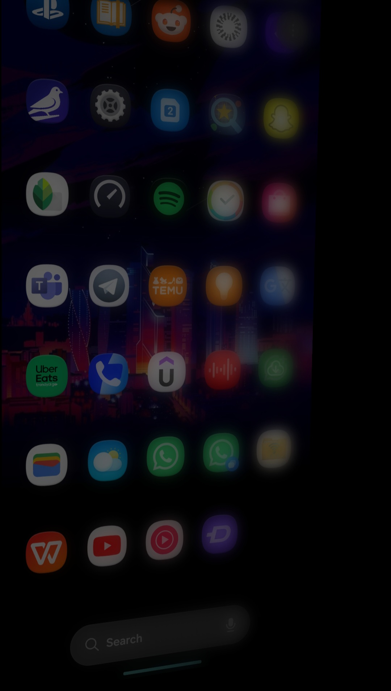
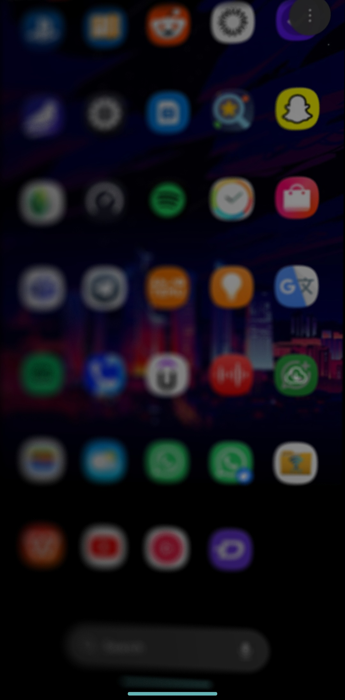
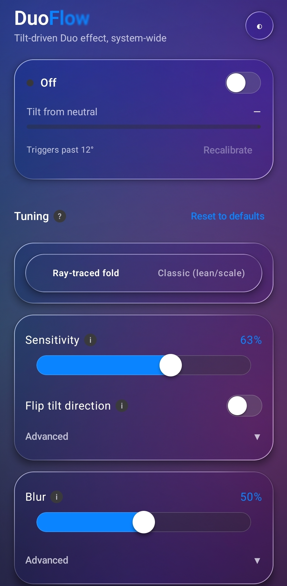
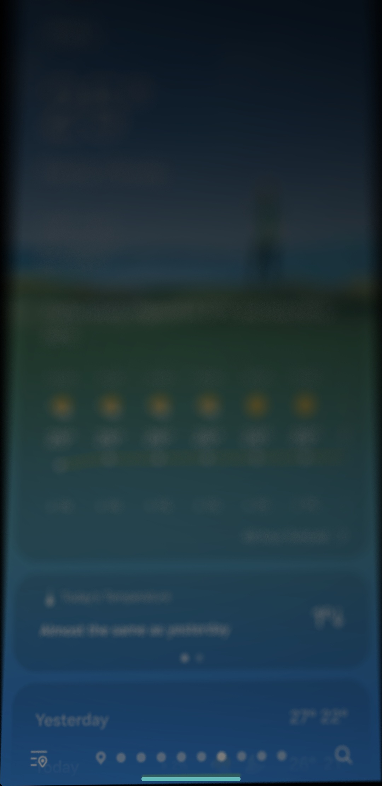

# DuoFlow — iPhone Fold transition on any Android phone

DuoFlow recreates the iPhone Fold/Duo's fold-blur transition — captured
screen content that leans, blurs and dims as if hinging on an edge — on a
regular (non-foldable) Android phone, using device tilt instead of a real
hinge sensor. Two rendering modes: a ray-traced geometric fold (Android 13+)
and a classic lean/scale transform as a fallback (Android 12+).

## Screenshots

| | |
|---|---|
|  |  |
| Classic mode, tilted left — the near edge stays sharp, the far edge blurs. | Ray-traced mode, tilted right — same graduated effect, a different rendering model underneath. |
|  |  |
| Control panel, Tuning section — mode selector and live parameters. | The effect applied over real app content (Messages, Home, etc.), not a demo screen. |

## How it works
Enable it, tilt the phone, and whatever's on screen freezes into a leaning,
graded-blur snapshot until you tilt back to neutral — over any app, since it
captures real pixels via `MediaProjection` rather than blurring in place.

`TYPE_ROTATION_VECTOR` sensor reading → one frozen frame captured per
gesture → GPU rendering (an AGSL `RuntimeShader` ray trace, or a View 3D
transform fallback) → blur that intensifies away from the hinge edge in both
modes. Every parameter is tunable live, in-app — see [Tuning](#tuning).
Nothing about this modifies the system: it draws an overlay window while the
app's foreground service runs, and stops touching anything the moment you
disable it.

## Install
**Option A — GitHub Releases (recommended).** Download the APK from this
repo's [Releases page](../../releases) and sideload it: tapping the
downloaded file prompts for the "install unknown apps" permission, allow it,
then install. Release builds are signed with a stable key (see
[Cutting a release](#cutting-a-release)), so you can install a newer release
over an older one without uninstalling first.

**Option B — Build from source via GitHub Actions** (no local Android
Studio needed):
1. **Actions** tab → "Build Debug APK" → "Run workflow" (or push to `main`,
   which triggers it automatically).
2. Once it finishes, open the run and download `DuoFlow.apk` from
   **Artifacts**.
3. Sideload it the same way as Option A.

Local Android Studio also works (`Open` this folder, let Gradle sync, run ▶).

<details>
<summary>About the install-time warnings</summary>

Sideloading any app outside the Play Store always shows Android's "unknown
sources" prompt and usually a Play Protect "unrecognized app" notice — the OS
asking you to vouch for a source it hasn't verified, not specific to this
project, and not fixable from the app side.

What *is* fixed as of this release is **debug-signed distribution**: release
builds now use `assembleRelease` with a real signing key instead of the
auto-generated debug keystore every `assembleDebug` build carries, which is
what several AV/security scanners flag regardless of what the app does.
Tapping "Install anyway" past Play Protect's notice is expected and safe for
an open-source app you can read the full source of right here.
</details>

## Cutting a release
Push a tag matching `v*.*.*` (e.g. `v1.0.0`) to run
`.github/workflows/release.yml`, which builds an APK and publishes it to this
repo's Releases page automatically (or run it manually from **Actions** →
"Release" → "Run workflow"). With no setup at all it falls back to a
debug-signed build (logged as a warning in the run) so a release still goes
out.

The app's `versionName`/`versionCode` are derived from the tag itself (e.g.
`v1.2.3` → versionName `1.2.3`), not from anything hardcoded in
`app/build.gradle.kts` — so every tag automatically produces an installable
upgrade over the last one, with no manual version bump to remember.

To get a properly *signed* release instead (recommended), add these four
repository secrets once, under **Settings → Secrets and variables → Actions
→ New repository secret**:

| Secret | Value |
| --- | --- |
| `RELEASE_KEYSTORE_BASE64` | The release keystore, base64-encoded |
| `RELEASE_KEYSTORE_PASSWORD` | Its store password |
| `RELEASE_KEY_ALIAS` | Its key alias |
| `RELEASE_KEY_PASSWORD` | Its key password |

<details>
<summary>Generating a keystore</summary>

A keystore usable for this was generated as part of setting this up and sent
to you separately (not committed here — a signing key in the repo would let
anyone resign a malicious update), along with these exact four values.
**Keep that keystore file backed up somewhere safe** — if it's ever lost,
every future release has to switch to a new key, and Android will refuse to
let anyone upgrade from an app installed with the old one without
uninstalling it first.

To generate a different one instead:
```
keytool -genkeypair -v -keystore release.keystore -alias duoflow \
  -keyalg RSA -keysize 2048 -validity 10000
base64 -w0 release.keystore   # paste this output as RELEASE_KEYSTORE_BASE64
```
</details>

## Tuning
Open the app and hit "Enable" — it asks for the "display over other apps"
permission, then a one-time screen-capture consent dialog. The Tuning
section holds every parameter (activation threshold, blur intensity,
perspective depth, etc.), adjustable live while the effect is running. Each
slider except Activation threshold and Full-tilt point has its own on/off
switch, so a parameter can be disabled without losing its saved value. Hit
"Recalibrate" to reset the neutral pose to however you're currently holding
the phone.

See **[docs/TUNING.md](docs/TUNING.md)** for the full parameter table and a
list of things that were investigated and ruled out.

## Known limitations
- Requires Android 12 (API 31) or newer.
- Shows the system's screen-recording indicator for as long as the feature
  is enabled, not just during a tilt — the cost of keeping one capture
  session open instead of re-prompting for consent on every gesture.
- Apps that set `FLAG_SECURE` (banking, Netflix, password managers) capture
  as black, not blurred — an Android-wide protection with no workaround from
  here.
- Ray-traced mode needs API 33+ for AGSL `RuntimeShader` support, and even
  there it can fail to compile on a given device's GPU driver; either case
  falls back to the classic lean/scale renderer automatically.
- Sensor calibration ("Recalibrate") is needed on first launch, and again any
  time holding the phone at an angle becomes your new "neutral" pose — the
  effect measures deviation from whatever pose was neutral when last
  calibrated, not absolute level.

## Credits
This project ports the geometric ray-trace fold model from
[Atomicx7/Duo-animation](https://github.com/Atomicx7/Duo-animation) (itself
a Kotlin/AGSL port of elijah-semyonov's `DuoLikeAnimation`, originally
SwiftUI/Metal), generalized from that project's single left/right hinge to
all four screen edges. The classic lean/scale fallback is an independent
approximation built for this project, for older-device compatibility rather
than ported from anywhere.
